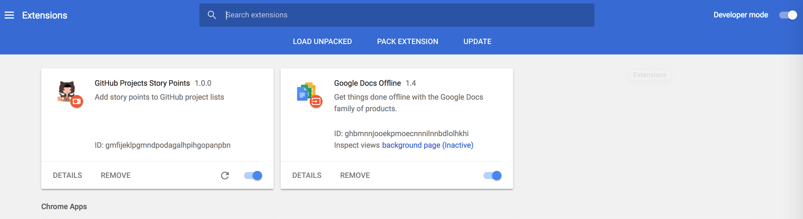

# GitHub Projects Story Points

A Chrome Extension to add [SCRUM](https://en.wikipedia.org/wiki/Scrum_(software_development))
[story points](https://en.wikipedia.org/wiki/Planning_poker) pretty display to
[GitHub Projects](https://help.github.com/articles/about-projects/).

You notes/PR/issues should have a title like `(2) My issue title` and the "(2)"
will be converted in a nice tag. Also all projects lists will have the total count
of story points in them next to the count of cards.

## To Install

1. Download all the files in the directory.  You can do this by running the `git clone https://github.com/bradAnderson58/github-project-story-points.git` command, or if you don't have git installed on your machine, simply click the green "Clone or download" button on the top right of this page, and select "Download ZIP"
1. Launch Chrome
1. Open chrome://extensions/
1. Make sure "Developer mode" in the top right corner is CHECKED
1. Click "Load Unpacked"
1. Select the directory you downloaded all the files to.

**GitHub Projects Story Points** should now appear in your Extensions lists

1. Reload the extension page or click the "Reload" link under **GitHub Projects Story Points**
1. Open your Projects or Issues pages in your Repo on GitHub.com
1. You should now see any items with (#) preceeding the title added up as (# points)

